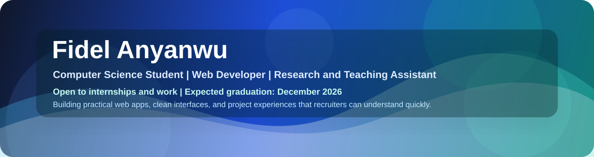
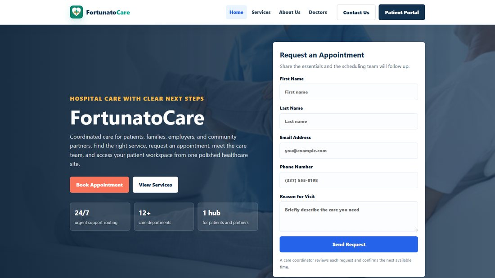

<div align="center">



# Hi, I'm Fidel Anyanwu

### Computer Science Student | Web Developer | Research and Teaching Assistant

I build practical web apps with clean interfaces, thoughtful user flows, and project pages that make the work easy to understand. I am open to internships and work opportunities while I finish my degree, with an expected graduation date of December 2026.

[](https://fidel-portfolio-eta.vercel.app/)
[](https://www.linkedin.com/in/fidel-anyanwu-98a34124b/)
[](mailto:fanyanwu@mcneese.edu)


</div>

---

## Recruiter Snapshot

<table>
  <tr>
    <td width="50%">
      <h3>What I Build</h3>
      <p>Responsive websites, full-stack app features, dashboards, forms, auth-style flows, localStorage apps, AI-assisted tools, and browser games.</p>
    </td>
    <td width="50%">
      <h3>What I Bring</h3>
      <p>I care about making projects feel finished: clear UI, readable README files, live links, screenshots, deployment checks, and user flows that make sense.</p>
    </td>
  </tr>
  <tr>
    <td width="50%">
      <h3>Current Direction</h3>
      <p>I am strengthening my React, Next.js, TypeScript, Supabase, API, SQL, and deployment skills while continuing to build portfolio-ready apps.</p>
    </td>
    <td width="50%">
      <h3>Looking For</h3>
      <p>Software, web development, IT/CS internship, volunteer, and entry-level opportunities where I can learn from a team and contribute consistently. Expected graduation: December 2026.</p>
    </td>
  </tr>
</table>

---

## About Me

I am a computer science student at McNeese State University who enjoys turning ideas into usable, presentable projects. A lot of my work starts with a simple question: "Would someone understand what to do here without me explaining it?"

That mindset shows up in my projects. I have built AI-assisted apps, study productivity tools, campus platforms, browser games, healthcare websites, fitness interfaces, and collaborative full-stack work. I like the mix of design, logic, data, and deployment because it forces me to think about the whole experience, not just one file.

```txt
Focus: clean interfaces, practical features, polished project presentation
Learning: React, Next.js, TypeScript, Supabase, APIs, SQL, deployment workflows
Open to: internships, work opportunities, entry-level software roles, web projects, and collaborative builds
Graduation: December 2026
```

---

## Project Gallery

<table>
  <tr>
    <td width="50%">
      
      <h3>SnapChef</h3>
      <p>AI food image assistant with upload, results, saved scan history, nutrition notes, substitutions, and estimate details.</p>
      <p><a href="https://snapchef-lckic8lxq-fidel-anyanwu-s-projects.vercel.app/">Live Site</a> | <a href="https://github.com/Fidel2197/snapchef">Repository</a></p>
    </td>
    <td width="50%">
      
      <h3>StudyOps</h3>
      <p>Study command center for notes, tasks, files, flashcards, quizzes, backups, and short-notice study planning.</p>
      <p><a href="https://studyops-seven.vercel.app/">Live Site</a> | <a href="https://github.com/Fidel2197/StudyOps">Repository</a></p>
    </td>
  </tr>
  <tr>
    <td width="50%">
      
      <h3>FortunatoCare</h3>
      <p>Multi-page healthcare site with appointment intake, doctor profiles, separate service pages, organization copy, and portal account flow.</p>
      <p><a href="https://hospital-website-psi-three.vercel.app/">Live Site</a> | <a href="https://github.com/Fidel2197/Hospital-Website">Repository</a></p>
    </td>
    <td width="50%">
      
      <h3>Campus Connect</h3>
      <p>Campus platform for tutors, events, groups, messages, reports, profile tools, and student hub actions.</p>
      <p><a href="https://campus-connect-phi-teal.vercel.app/">Live Site</a> | <a href="https://github.com/Fidel2197/Campus-Connect">Repository</a></p>
    </td>
  </tr>
</table>

---

## Featured Work

| Project | Why It Stands Out | Stack | Links |
| --- | --- | --- | --- |
| **SnapChef** | Full-stack AI food image assistant with upload, scan history, results, nutrition notes, substitutions, estimates, and delete flows. | Next.js, React, TypeScript, Supabase, AI APIs | [Live Site](https://snapchef-lckic8lxq-fidel-anyanwu-s-projects.vercel.app/) / [Repository](https://github.com/Fidel2197/snapchef) |
| **StudyOps** | Study command center with files, notes, tasks, flashcards, quizzes, backups, account-style access, and Panic Mode planning. | HTML, CSS, JavaScript, localStorage | [Live Site](https://studyops-seven.vercel.app/) / [Repository](https://github.com/Fidel2197/StudyOps) |
| **Campus Connect** | Multi-page student platform for tutors, events, groups, messages, map pins, reports, profiles, and grouped hub actions. | HTML, CSS, JavaScript | [Live Site](https://campus-connect-phi-teal.vercel.app/) / [Repository](https://github.com/Fidel2197/Campus-Connect) |
| **FortunatoCare** | Hospital website with separate pages, appointment intake, doctor profiles, company-ready messaging, unique healthcare imagery, and a portal account flow. | HTML, CSS, JavaScript, localStorage | [Live Site](https://hospital-website-psi-three.vercel.app/) / [Repository](https://github.com/Fidel2197/Hospital-Website) |
| **FitNex** | Fitness tracker website with workout logging, weekly goals, progress summaries, guidance content, and responsive pages. | HTML, CSS, Bootstrap, JavaScript | [Live Site](https://fitness-website-tawny.vercel.app/) / [Repository](https://github.com/Fidel2197/Fitness-Website) |
| **Arcane Duel** | Canvas gesture-combat game with spell drawing, cooldowns, health, mana, difficulty modes, pause, and quit controls. | HTML, CSS, JavaScript, Canvas | [Live Site](https://arcane-duel-sable.vercel.app/) / [Repository](https://github.com/Fidel2197/Arcane-Duel) |
| **Tetris Game** | Browser Tetris game with scoring, levels, hold, next preview, ghost piece, keyboard controls, pause, restart, and quit flow. | HTML, CSS, JavaScript, Canvas | [Live Site](https://tetris-game-fidel2197.vercel.app/) / [Repository](https://github.com/Fidel2197/Tetris-Game) |

---

## Skills

| Area | Skills |
| --- | --- |
| **Frontend** | HTML, CSS, JavaScript, responsive layouts, forms, dashboards, accessibility-minded UI, Bootstrap |
| **Modern Web** | React, Next.js, TypeScript, component-based interfaces, API routes |
| **Backend and Data** | Supabase, SQL, T-SQL, saved records, auth-style flows, verification flows |
| **Programming** | Python, Java, JavaScript, TypeScript |
| **App State** | localStorage, account-style sessions, saved tasks, scan history, user settings |
| **Deployment and Docs** | Git, GitHub, Vercel, live-site QA, README writing, screenshots, project cleanup |
| **Professional Tools** | Excel, Word, PowerPoint, Microsoft 365 workflows |

---

## Tech Toolbox

<div align="center">


</div>

---

## GitHub Snapshot

<div align="center">


</div>

---

## How I Approach Projects

- I start with the user flow first: what should someone understand or do in the first few seconds?
- I make projects feel real by adding polished copy, useful empty states, forms, saved state, and live links.
- I keep improving older work instead of leaving it half-finished.
- I care about presentation because clean documentation and screenshots help people trust the code faster.

---

## Currently Focused On

- Strengthening my portfolio for internship, job, and company applications.
- Turning class and personal projects into clean live sites with strong README documentation.
- Building better account flows, saved app state, dashboards, and responsive interfaces.
- Keeping my GitHub repositories easier to review with project links, screenshots, setup notes, and live QA.

---

## Connect

- Portfolio: [fidel-portfolio-eta.vercel.app](https://fidel-portfolio-eta.vercel.app/)
- LinkedIn: [Fidel Anyanwu](https://www.linkedin.com/in/fidel-anyanwu-98a34124b/)
- Email: [fanyanwu@mcneese.edu](mailto:fanyanwu@mcneese.edu)
- GitHub: [Fidel2197](https://github.com/Fidel2197)

<div align="center">

**Thanks for visiting. I am always improving the work here.**

</div>
