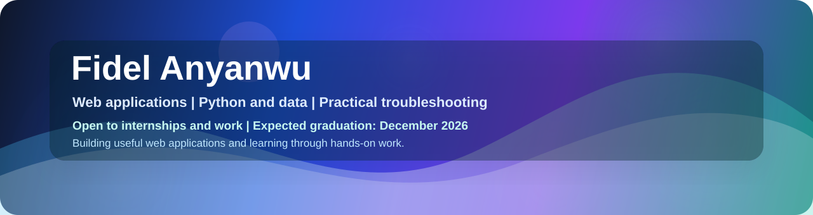
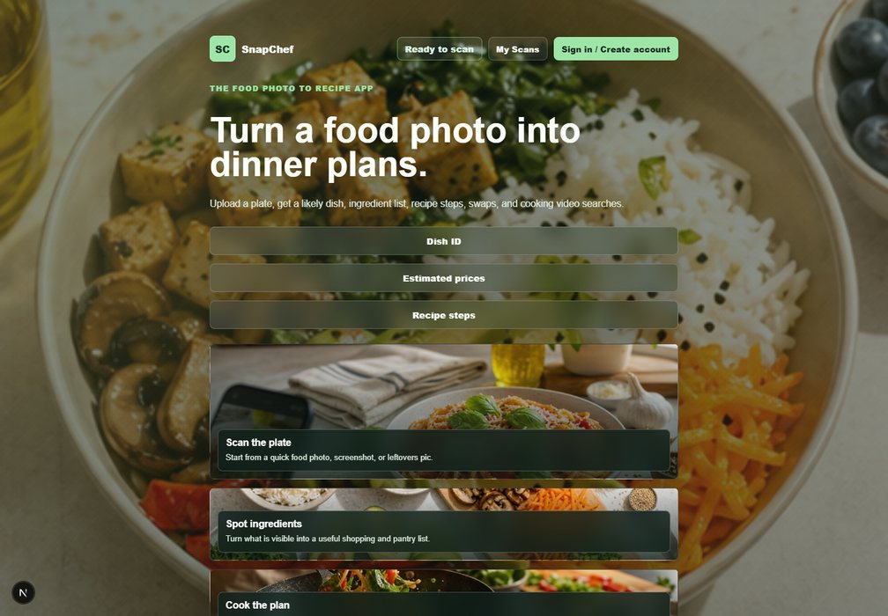
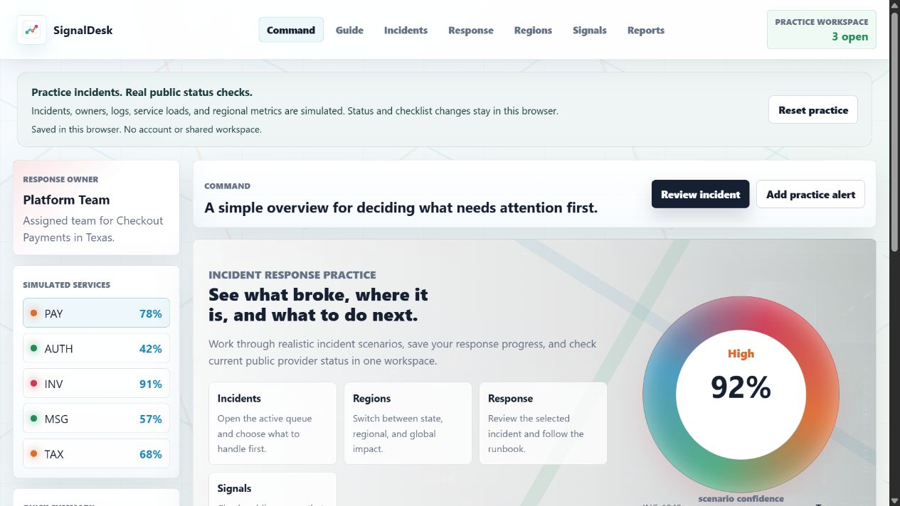
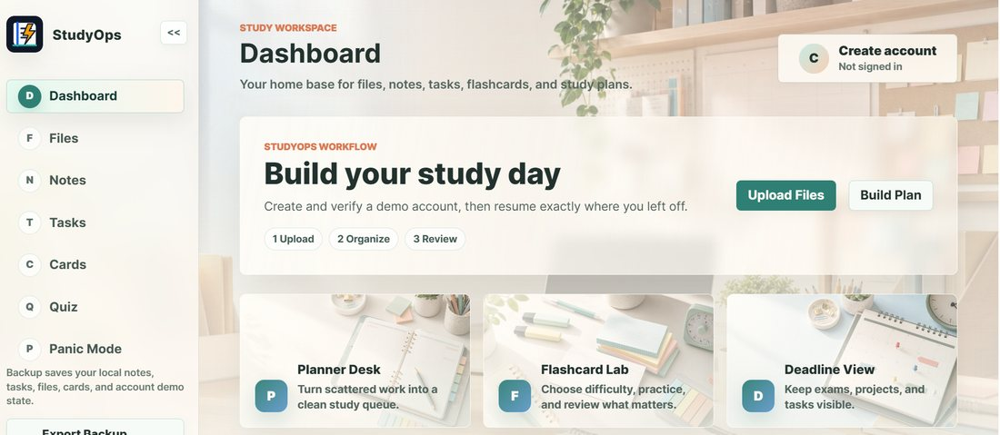
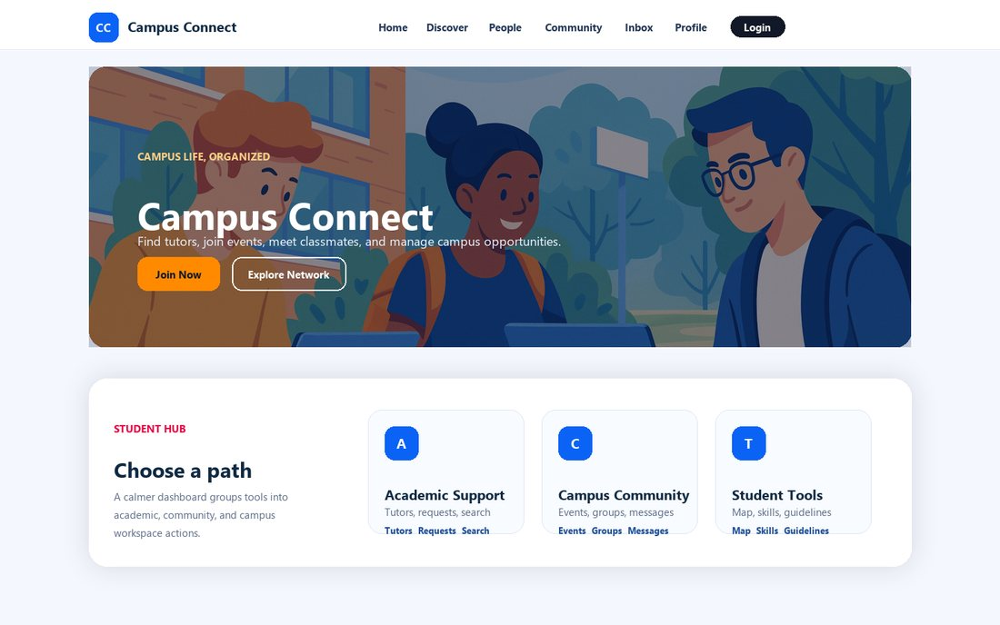
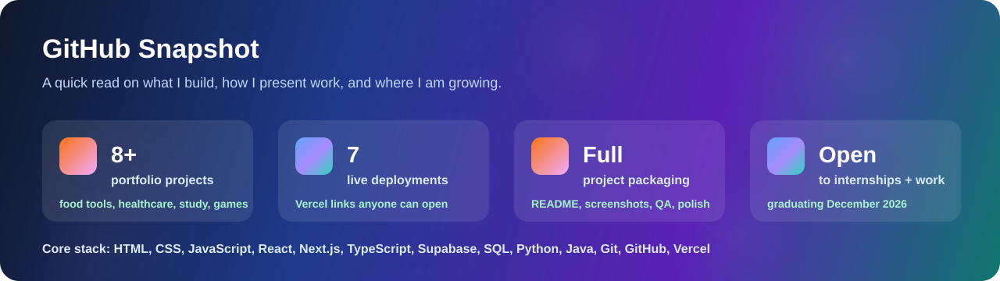

<div align="center">



# Hi, I'm Fidel Anyanwu

### Computer Science Student | Software, Data, and IT Support Projects | Research and Teaching Assistant

I build practical applications, dashboards, database-aware features, browser tools, and deployed project sites with clean workflows, thoughtful data handling, and documentation that makes the work easy to review. My work connects programming, application behavior, SQL, Microsoft tools, systems concepts, troubleshooting, testing, and user support. I am open to internships and work opportunities while I finish my degree, with an expected graduation date of December 2026.

<p>
  <a href="https://fidel-portfolio-eta.vercel.app/" target="_blank" rel="noopener noreferrer">
    
  </a>
  <a href="https://www.linkedin.com/in/fidel-anyanwu-98a34124b/" target="_blank" rel="noopener noreferrer">
    
  </a>
  <a href="mailto:fanyanwu@mcneese.edu" target="_blank" rel="noopener noreferrer">
    
  </a>
  
  
</p>


</div>

---

## Quick Look

<table>
  <tr>
    <td width="50%">
      <h3>What I Like Building</h3>
      <p>I like turning rough ideas into applications, dashboards, study tools, database-backed features, and project workflows that someone can open, test, and understand without a long explanation.</p>
    </td>
    <td width="50%">
      <h3>How I Work</h3>
      <p>I pay attention to the whole project: requirements, layout, forms, saved data, validation, links, README files, testing notes, and whether the deployed version actually works.</p>
    </td>
  </tr>
  <tr>
    <td width="50%">
      <h3>Technical Areas</h3>
      <p>My current skill set connects JavaScript, TypeScript, Python, C, SQL/T-SQL, REST APIs, Supabase, Microsoft SQL Server, Windows and Linux fundamentals, GitHub, Vercel, and Microsoft 365.</p>
    </td>
    <td width="50%">
      <h3>What I Am Open To</h3>
      <p>I am open to internships, work opportunities, volunteer experience, IT support work, analyst-style roles, and team projects where I can contribute consistently. Expected graduation: December 2026.</p>
    </td>
  </tr>
</table>


---

## About Me

I am a computer science student at McNeese State University who enjoys turning ideas into usable, presentable projects. A lot of my work starts with a simple question: "Would someone understand what to do here without me explaining it?"

That mindset shows up in my projects. I have built food photo tools, incident response workspaces, study productivity apps, campus platforms, browser games, healthcare sites, fitness interfaces, and collaborative full-stack work. I like the mix of programming, data flow, systems thinking, deployment, documentation, troubleshooting, and team communication because it forces me to think about the whole workflow, not just one screen.

```txt
Focus: practical applications, saved data, database workflows, deployed projects, testing notes, and polished project presentation
Technical mix: JavaScript, TypeScript, Python, C, SQL, T-SQL, REST APIs, Supabase, Microsoft SQL Server, Git, GitHub, Vercel, Windows, Linux command line, and Microsoft 365
Open to: internships, work opportunities, entry-level software roles, IT analyst work, technical support, web projects, and collaborative builds
Graduation: December 2026
```

---

## Project Gallery

<table>
  <tr>
    <td width="50%">
      
      <h3>SnapChef</h3>
      <p>Food photo assistant with upload, results, saved scan history, nutrition notes, substitutions, and estimate details.</p>
    </td>
    <td width="50%">
      
      <h3>SignalDesk</h3>
      <p>Incident response workspace with separate command, incidents, response, regions, public signals, and reports views.</p>
    </td>
  </tr>
  <tr>
    <td width="50%">
      
      <h3>StudyOps</h3>
      <p>Study command center for notes, tasks, files, flashcards, quizzes, backups, and short-notice study planning.</p>
    </td>
    <td width="50%">
      
      <h3>Campus Connect</h3>
      <p>Campus platform for tutors, events, groups, messages, reports, profile tools, and student hub actions.</p>
    </td>
  </tr>
</table>


---

## Featured Work

<table>
  <thead>
    <tr>
      <th>Project</th>
      <th>Why It Stands Out</th>
      <th>Stack</th>
      <th>Links</th>
    </tr>
  </thead>
  <tbody>
    <tr>
      <td><strong>SnapChef</strong></td>
      <td>Full-stack food image assistant with upload, scan history, results, nutrition notes, substitutions, estimates, and delete flows.</td>
      <td>Next.js, React, TypeScript, Supabase, AI APIs</td>
      <td><a href="https://snapchef-nine.vercel.app/" target="_blank" rel="noopener noreferrer">Live Site</a> / <a href="https://github.com/Fidel2197/snapchef" target="_blank" rel="noopener noreferrer">Repository</a></td>
    </tr>
    <tr>
      <td><strong>SignalDesk</strong></td>
      <td>Incident response workspace with focused command, incident, response, region, signal, and report views plus public status checks from GitHub, Vercel, and Cloudflare.</td>
      <td>Next.js, React, TypeScript, Server Routes, Public Status Signals, Vercel</td>
      <td><a href="https://signaldesk-pink-two.vercel.app/" target="_blank" rel="noopener noreferrer">Live Site</a> / <a href="https://github.com/Fidel2197/SignalDesk" target="_blank" rel="noopener noreferrer">Repository</a></td>
    </tr>
    <tr>
      <td><strong>StudyOps</strong></td>
      <td>Browser study command center with account-style access, local data persistence, files, notes, tasks, flashcards, quizzes, backups, and Panic Mode planning.</td>
      <td>HTML, CSS, JavaScript, localStorage, Data Persistence</td>
      <td><a href="https://studyops-seven.vercel.app/" target="_blank" rel="noopener noreferrer">Live Site</a> / <a href="https://github.com/Fidel2197/StudyOps" target="_blank" rel="noopener noreferrer">Repository</a></td>
    </tr>
    <tr>
      <td><strong>Campus Connect</strong></td>
      <td>Multi-page student platform for tutors, events, groups, messages, map pins, reports, profiles, and grouped hub actions.</td>
      <td>HTML, CSS, JavaScript</td>
      <td><a href="https://campus-connect-phi-teal.vercel.app/" target="_blank" rel="noopener noreferrer">Live Site</a> / <a href="https://github.com/Fidel2197/Campus-Connect" target="_blank" rel="noopener noreferrer">Repository</a></td>
    </tr>
    <tr>
      <td><strong>FortunatoCare</strong></td>
      <td>Hospital website with separate pages, appointment intake, doctor profiles, company-ready messaging, unique healthcare imagery, and a portal account flow.</td>
      <td>HTML, CSS, JavaScript, localStorage</td>
      <td><a href="https://hospital-website-psi-three.vercel.app/" target="_blank" rel="noopener noreferrer">Live Site</a> / <a href="https://github.com/Fidel2197/Hospital-Website" target="_blank" rel="noopener noreferrer">Repository</a></td>
    </tr>
    <tr>
      <td><strong>FitNex</strong></td>
      <td>Fitness tracker website with workout logging, weekly goals, progress summaries, guidance content, and responsive pages.</td>
      <td>HTML, CSS, Bootstrap, JavaScript</td>
      <td><a href="https://fitness-website-tawny.vercel.app/" target="_blank" rel="noopener noreferrer">Live Site</a> / <a href="https://github.com/Fidel2197/Fitness-Website" target="_blank" rel="noopener noreferrer">Repository</a></td>
    </tr>
    <tr>
      <td><strong>Arcane Duel</strong></td>
      <td>Canvas gesture-combat game with spell drawing, cooldowns, health, mana, difficulty modes, pause, and quit controls.</td>
      <td>HTML, CSS, JavaScript, Canvas</td>
      <td><a href="https://arcane-duel-sable.vercel.app/" target="_blank" rel="noopener noreferrer">Live Site</a> / <a href="https://github.com/Fidel2197/Arcane-Duel" target="_blank" rel="noopener noreferrer">Repository</a></td>
    </tr>
    <tr>
      <td><strong>Tetris Game</strong></td>
      <td>Browser Tetris game with scoring, levels, hold, next preview, ghost piece, keyboard controls, pause, restart, and quit flow.</td>
      <td>HTML, CSS, JavaScript, Canvas</td>
      <td><a href="https://tetris-game-fidel2197.vercel.app/" target="_blank" rel="noopener noreferrer">Live Site</a> / <a href="https://github.com/Fidel2197/Tetris-Game" target="_blank" rel="noopener noreferrer">Repository</a></td>
    </tr>
  </tbody>
</table>

---

## Skills

| Area | Skills |
| --- | --- |
| **Programming Languages** | Python; JavaScript; C; SQL; T-SQL; HTML; CSS; Bash/Shell scripting |
| **Web & Application Development** | Responsive web design; DOM manipulation; form handling; REST API integration; JSON; localStorage; authentication workflows; search/filter functionality; client-side state management; browser debugging tools |
| **Database & Data Management** | Microsoft SQL Server; SQL Server Management Studio; relational database design; data modeling; normalization; joins; constraints; primary/foreign keys; schema design; data validation; CSV data loading; query troubleshooting |
| **Systems & IT Administration** | Windows Server; Active Directory; DNS/DNSSEC; Group Policy; organizational units; user/group administration; access and permission management; Active Directory replication; Linux/Unix fundamentals; system troubleshooting |
| **Software Engineering & Testing** | Software Development Life Cycle (SDLC); functional and non-functional requirements; software testing; debugging; defect isolation; workflow testing; requirements gathering; technical documentation |
| **Tools & Platforms** | Visual Studio Code; Git; GitHub; Microsoft Office Suite; Windows; Linux command line; browser developer tools; Vercel deployments |
| **Technical Strengths** | Troubleshooting; problem solving; user support; application debugging; data-flow analysis; technical documentation; testing and validation |

---

## Tech Toolbox

<div align="center">


</div>

---

## GitHub Snapshot

<div align="center">




</div>

---

## How I Approach Projects

- I start with the user flow first: what should someone understand or do in the first few seconds?
- I make projects feel real by adding polished copy, useful empty states, forms, saved state, and live links.
- I keep improving older work instead of leaving it half-finished.
- I care about presentation because clean documentation and screenshots help people trust the code faster.

---

## Current Focus

- Keeping my portfolio, resume, and GitHub profile aligned for internship, job, and company applications.
- Turning class and personal projects into clean deployed sites with strong README documentation, screenshots, and setup notes.
- Building better account flows, saved app state, database-backed features, dashboards, search/filter behavior, and validation flows.
- Connecting project work to SQL/T-SQL, Microsoft SQL Server concepts, data-flow analysis, troubleshooting, testing, and user support.
- Keeping repositories easier to review with live links, project descriptions, feature notes, and clear technical decisions.

---

## Connect

- Portfolio: <a href="https://fidel-portfolio-eta.vercel.app/" target="_blank" rel="noopener noreferrer">fidel-portfolio-eta.vercel.app</a>
- LinkedIn: <a href="https://www.linkedin.com/in/fidel-anyanwu-98a34124b/" target="_blank" rel="noopener noreferrer">Fidel Anyanwu</a>
- Email: <a href="mailto:fanyanwu@mcneese.edu" target="_blank" rel="noopener noreferrer">fanyanwu@mcneese.edu</a>
- GitHub: <a href="https://github.com/Fidel2197" target="_blank" rel="noopener noreferrer">Fidel2197</a>

<div align="center">

**Thanks for visiting. I am always improving the work here.**

</div>
