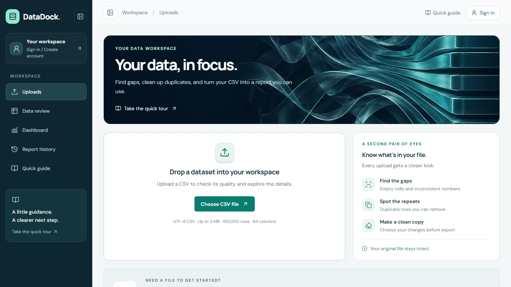

<strong>Computer Science at McNeese State University · Graduating December 2026</strong>

I build web applications that turn messy inputs into useful workflows—from CSV analysis to recipes from food photos. I care about the interface, the data behind it, and what happens when something goes wrong.

  
  
  
  

Open to internships and entry-level software development or IT opportunities.

### Three projects to start with

<table>
  <tr>
    <td width="48%" valign="middle">
      
    </td>
    <td width="52%" valign="top">
      <h3>DataDock</h3>
      
<strong>From a messy CSV to a useful report.</strong>

      
Inspect missing values and duplicates, explore charts, choose cleanup steps, and export a new copy. Accounts keep reports available across devices, with ownership checks and account-isolation tests.

      
React · TypeScript · FastAPI · pandas · PostgreSQL

      
<a href="https://datadock-fidel2197.vercel.app/">Open app ↗</a> · <a href="https://github.com/Fidel2197/DataDock">Source</a> · <a href="https://fidel-portfolio-eta.vercel.app/datadock.html">Build notes</a>

    </td>
  </tr>
</table>

<table>
  <tr>
    <td width="50%" valign="top">
      
      <h3>SnapChef</h3>
      
Start with a food photo and work toward something you can cook: recipe ideas, substitutions, budget and equipment preferences, and saved scans. AI estimates and fixed examples are clearly identified.

      
Next.js · TypeScript · Supabase · AI APIs

      
<a href="https://snapchef-nine.vercel.app/">Open app ↗</a> · <a href="https://github.com/Fidel2197/snapchef">Source</a> · <a href="https://fidel-portfolio-eta.vercel.app/snapchef.html">Build notes</a>

    </td>
    <td width="50%" valign="top">
      
      <h3>SignalDesk</h3>
      
Practice incident triage, follow runbooks, and save response progress in your browser. Simulated scenarios are separate from real public status checks. Status changes survive a refresh.

      
Next.js · React · TypeScript · Public status APIs

      
<a href="https://signaldesk-pink-two.vercel.app/">Open app ↗</a> · <a href="https://github.com/Fidel2197/SignalDesk">Source</a> · <a href="https://fidel-portfolio-eta.vercel.app/signaldesk.html">Build notes</a>

    </td>
  </tr>
</table>

Also worth a look: **[StudyOps](https://github.com/Fidel2197/StudyOps)** for course material, flashcards, deadlines, and timed study plans; **[Arcane Duel](https://github.com/Fidel2197/Arcane-Duel)** for canvas game logic; and **[Cowboy Bookstore](https://github.com/CowboysBookstore/bookstore)** for a collaborative React/Django course project.

### Tools behind the work

  
  
  
  
  
  
  
  

The project notes connect these tools to specific decisions: React components and state, Python analysis, SQL data models, API boundaries, automated tests, and deployment. [See the skills in context →](https://fidel-portfolio-eta.vercel.app/skills.html)

### Beyond the projects

<table>
  <tr>
    <td width="50%" valign="top">
      <h4>Teaching and technical support</h4>
      
Supported 30+ students in JavaScript and HTML labs and tested 100+ assignments. Helped students reproduce bugs, inspect browser errors, and work through Tetris logic without taking over their code.

    </td>
    <td width="50%" valign="top">
      <h4>Research and community work</h4>
      
Tested robotic prototypes, isolated sensor and motor issues, and documented iterations. As an RA, I support a community of 50+ students through communication, follow-up, and daily housing operations.

    </td>
  </tr>
</table>

[Read the work examples and coursework →](https://fidel-portfolio-eta.vercel.app/experience.html)

### How I build

I use AI-assisted development tools for implementation support, refactoring, documentation, and testing. I set the product requirements and priorities, review the resulting behavior, and decide what needs another revision. [My approach](https://fidel-portfolio-eta.vercel.app/approach.html) connects that process to specific improvements and explains the project boundaries.

<strong>Have a role or project in mind?</strong> <a href="mailto:fanyanwu@mcneese.edu">Let’s talk</a> · <a href="https://fidel-portfolio-eta.vercel.app/">Explore the portfolio</a>

